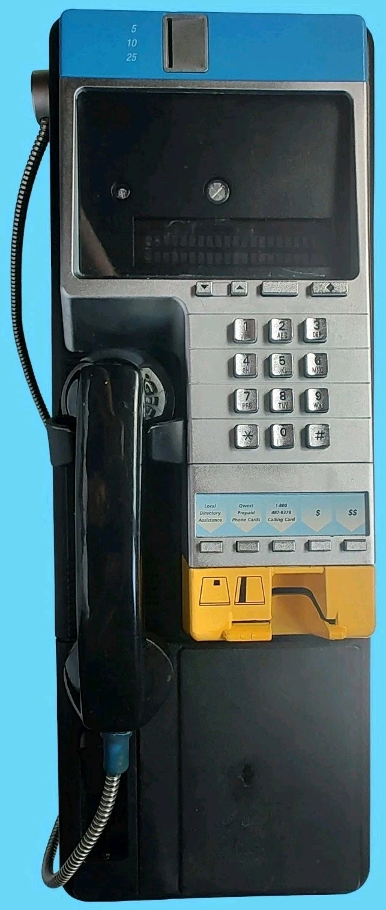

# CoinLine Terminal Emulator

> A hardware-faithful **MAME-based emulator** for **Millennium-compatible Z180 payphone terminals** — boots real firmware on a cycle-accurate Z180, models the full device tree, and bridges the modem UART out to a host application so the emulated terminal behaves like a physical unit on the wire.

<p align="center">
  
</p>

<p align="center">
  <a href="https://github.com/andrew867/CoinLine-emu/actions/workflows/cpp-tests.yml"></a>
  <a href="https://github.com/andrew867/CoinLine-emu/actions/workflows/fixtures.yml"></a>
  <a href="LICENSE"></a>
  
  
  
</p>

---

This is **not** a browser mock, not a protocol simulator, and not a high-level "fake terminal." It executes real terminal firmware on a real CPU model, exercises real device-driver paths, and is structured to live as a regular MAME driver tree under [`src/mame/coinline/`](src/mame/coinline/) inside an upstream MAME source checkout.

## Why this exists

Payphone terminal validation has historically required a wall of physical hardware, a workshop full of cables, and a willing engineer at every desk. This project reduces that to a binary you can run on any developer laptop, hooked up to a real host application over TCP, WebSocket, named pipe, or serial, with reproducible scenarios and deterministic evidence bundles.

The emulator is for:

- **Engineers** bringing up new firmware revisions on a known-good emulated platform — no service truck, no lab bench.
- **QA / validation teams** running scripted acceptance scenarios against the real firmware code path, with deterministic per-run evidence.
- **Integration teams** wiring a host product (call accounting, table downloads, smart-card validation, software upgrades) to a faithfully emulated terminal over a network transport.
- **Curious engineers** studying a complete Z180-based embedded system — CPU, devices, peripherals, NVRAM, modem, audio, and HMI — in one tree.

## Companion project

- **[CoinLine Payphone Management Platform](https://github.com/andrew867/CoinLine)** — the **server-side** counterpart for the same payphone family. Provisioning, table distribution, call rating, cards/account administration, technician craft workflows, firmware orchestration, DLOG/NCC inspection, and audit, on .NET 9 + React + PostgreSQL. The emulator is useful for bringing up and validating that host platform end-to-end without physical terminals.

## Project status — honest version

The project is **a working bring-up**, not a finished product. It has reached the point where help from other engineers, preservation hackers, or MAME contributors would unlock the next milestone faster than working on it alone.

**What's working today**

- Full MAME machine driver compiles and registers `millennium` as a short-name.
- CMake bring-up library + 15 fixture schema tests + a device-level CTest suite all pass.
- Firmware boots through **M6 (VFD initialised + first message)** and **M7A/M7B (telephony ACK + CSI/O RX path framing)** on representative firmware images.
- Voiceware uPD7759 core path is enabled by default and renders deterministic phrase traces.
- Host bridge over TCP is implemented and byte-transparent.

**Where it's stuck (this is where help would land)**

- **M7C — "telephony ready" service-task progression.** The firmware reads `POWER_ON_ACK (0x72)`, accepts a variable-length `0xC0` telephony-status frame, and we have the CSI/O RX buffer dump to prove it — but the VFD never leaves the *"Telephony board not responding"* screen. Either the RTOS service-task dispatch is missing one more flag transition, or the craft/power-on-prompt branch is taking a path we haven't modelled yet. See [`docs/status/m7c-telephony-ready-branch-analysis.md`](docs/status/m7c-telephony-ready-branch-analysis.md) for the trail of breadcrumbs.
- **M8 / M9 / M10 — interactive front panel, voiceware-to-speaker, idle demo prompt.** All gated on M7C clearing.
- **Disconnect supervision, full scenario runner, evidence-bundle CI gating.** Partially implemented; documented in [`TESTING.md`](TESTING.md).

If you've worked on Z180 bring-up, MAME drivers, CSI/O-based co-processor protocols, or you have a debug port / logic-analyser dump for a real-hardware unit, [open an issue](https://github.com/andrew867/CoinLine-emu/issues) — even a "here's a register transcript from boot" is useful.

## Highlights

- **Real firmware execution.** Compiled terminal firmware is loaded into the emulated flash region and executed on a cycle-accurate Z180 core. No high-level pretender for the firmware code path.
- **Complete device tree.** 2-line and 11-line VFD variants, keypad matrix, hookswitch & handset, magstripe card reader, ISO 7816 smart-card reader, coin validator with denomination pulse trains, alerter audio, lock/door/vault/service inputs, modem UART with carrier handling, NVRAM, table storage, and the on-board telephony co-processor.
- **Voiceware (uPD7759).** Banked voice-ROM playback with NEC IC-2323A timing semantics, configurable RC filter and gain, BUSY/INT0-grounded scheduling, deterministic phrase tracing.
- **Host bridge.** Modem UART byte stream forwarded over TCP, WebSocket, named pipe, or direct serial, byte-for-byte. A real host application sees exactly what a physical terminal puts on the wire.
- **Telephony co-processor in original code.** PCD3349A / 8048 firmware is shipped as MCS-48 assembly under [`tools/tp8048/`](tools/tp8048/) — originally authored here, GPL-2.0-or-later, with a build script that drops to a deterministic placeholder if you don't have an MCS-48 toolchain installed.
- **Scenario runner + evidence bundles.** Deterministic scripted runs produce a structured evidence bundle (boot trace, IO trace, VFD trace, voiceware trace, final VFD text, screenshots) so acceptance results are reproducible and reviewable.
- **Front-panel artwork & layout.** A clickable MAME `.lay` exposes the handset, keypad, quick-access keys, volume control, language selector, card slot, coin input/return, lock, door, vault, and service inputs.
- **First-class tests.** Unit, device, integration, regression, and acceptance tiers — wired up with CTest and a Python schema-validation suite for fixtures.
- **MSYS2 / MINGW64 builds on Windows.** Native build path documented in [`docs/building-on-windows-msys2.md`](docs/building-on-windows-msys2.md).

## Quickstart

The emulator is most reliably built on Linux or under MSYS2 MINGW64 on Windows.

```bash
# Linux (Ubuntu LTS or similar)
git clone https://github.com/andrew867/CoinLine-emu.git
cd CoinLine-emu
cmake -S . -B build -DCMAKE_BUILD_TYPE=Release
cmake --build build -j
ctest --test-dir build --output-on-failure
```

```powershell
# Windows / MSYS2 MINGW64 (recommended for full MAME builds)
git clone https://github.com/andrew867/CoinLine-emu.git
cd CoinLine-emu
C:\msys64\usr\bin\bash.exe -lc "export MSYSTEM=MINGW64; export CHERE_INVOKING=1; \
  export PATH=/mingw64/bin:/usr/bin:\$PATH && cmake -S . -B build && \
  cmake --build build -j && ctest --test-dir build --output-on-failure"
```

Detailed prerequisites and toolchain matrices are in [`BUILDING.md`](BUILDING.md). For running the emulator with a firmware binary, board profile, and host-bridge endpoint see [`RUNNING.md`](RUNNING.md). For the full test taxonomy see [`TESTING.md`](TESTING.md).

## How it's built

```
                ┌──────────────────────────────────────────────┐
                │            MAME machine driver               │
                │            src/mame/coinline/                │
                │  ┌───────┐ ┌────────┐ ┌─────────┐ ┌────────┐ │
                │  │ Z180  │ │  VFD   │ │ Keypad  │ │ Modem  │ │
                │  │ core  │ │ 2/11ln │ │ + hook  │ │ ASCI   │ │
                │  └───────┘ └────────┘ └─────────┘ └────────┘ │
                │  ┌───────┐ ┌────────┐ ┌─────────┐ ┌────────┐ │
                │  │ NVRAM │ │ Cards  │ │ Coin    │ │ Alerter│ │
                │  │ +Tbls │ │ msg+IC │ │ + locks │ │ +Voice │ │
                │  └───────┘ └────────┘ └─────────┘ └────────┘ │
                │            ┌──────────────────┐              │
                │            │ TP 8048 firmware │              │
                │            │ (PCD3349A model) │              │
                │            └──────────────────┘              │
                └───────────────┬──────────────┬───────────────┘
                                │              │
                  modem UART    │              │   front-panel
                  byte stream   │              │   keypad / hook
                                ▼              ▼
                ┌──────────────────────┐   ┌─────────────────┐
                │   Host bridge        │   │  MAME artwork   │
                │   TCP / WS / pipe    │   │  clickable .lay │
                │   /serial — byte-    │   │  + screenshot   │
                │   transparent        │   │  capture        │
                └──────────────────────┘   └─────────────────┘
```

The host bridge is the licensing firewall: anything on the other side of it runs in a separate OS process and isn't linked into the emulator binary, so a host application's own license is not affected by the emulator's GPL.

## Repository layout

```
src/mame/coinline/       MAME machine driver + device models (registered with MAME)
src/devices/machine/     Stand-alone device models reusable outside MAME
specs/                   Machine-readable contracts per device and subsystem
test-plans/              Per-area test plans (fixtures, procedure, pass/fail criteria)
tests/                   CMake/CTest test programs (unit, device, integration, regression)
fixtures/                Board profiles, device maps, scenario inputs, golden traces
firmware/                Reference firmware images used by acceptance runs
docs/                    Architecture, plans, debugging guides, status notes
docs/tp8048/             Telephony co-processor execution spec, ASM state machine, wiring notes
tools/                   Build helpers, screenshot capture, evidence-bundle export, trace analyzers
tools/tp8048/            Original MCS-48 source + ROM-build script for the telephony co-processor
artwork/                 Front-panel artwork and clickable layout sources
.github/workflows/       GitHub Actions CI (CMake/CTest + fixture schema tests)
```

## Firmware

Firmware binaries are loaded by path at runtime. The default lookup is:

| File | Size | Purpose |
| ---- | ---- | ------- |
| `firmware/flash.bin` | 512 KiB | Primary flash image (or 1 MiB single-image install) |
| `firmware/flash1.bin` | 512 KiB | Secondary flash image (split-image installs) |
| `firmware/voice_a.bin` | 1 MiB | Primary voiceware ROM image |
| `firmware/voice_b.bin` | 1 MiB | Secondary voiceware ROM image |
| `firmware/telephony_subprocessor.rom` | 4 KiB | Behavioural model of the on-board telephony co-processor, built from [`tools/tp8048/`](tools/tp8048/) |

Override any of these via the `COINLINE_FIRMWARE`, `COINLINE_FIRMWARE_FLASH0`, `COINLINE_FIRMWARE_FLASH1`, `COINLINE_VOICE_ROM_A`, and `COINLINE_VOICE_ROM_B` environment variables (see [`RUNNING.md`](RUNNING.md)). Firmware images are governed by their respective licenses; this project does not redistribute firmware that contributors do not have the rights to release.

### Where the firmware came from

The flash and voiceware images shipped under `firmware/` for development and debugging are **publicly archived hardware firmware** — the same blobs that have been mirrored online for years by the preservation community. They are available from the CCC Munich wiki at <https://wiki.muc.ccc.de/millennium:firmwareversions> and from several Millennium-related GitHub mirrors. They are included here only so a fresh checkout can boot and exercise the emulator end-to-end. They will be removed for the v1 tagged release, and contributors are expected to bring their own images for any further work.

The telephony co-processor ROM (`firmware/telephony_subprocessor.rom`) is **not** a third-party blob — it is built from the original MCS-48 assembly under [`tools/tp8048/`](tools/tp8048/), which is part of this repository and shipped under the same GPL-2.0-or-later license as the rest of the source.

## Host bridge

The terminal's modem UART byte stream is bridged to a transport endpoint configured at launch. The bridge is byte-transparent: no protocol decoding, no validation, no application-layer pretending. Whatever the firmware emits, the bridge forwards verbatim, and vice versa. See [`docs/host-integration-plan.md`](docs/host-integration-plan.md) and [`docs/modem-uart-host-bridge.md`](docs/modem-uart-host-bridge.md).

## Testing

Two GitHub Actions workflows run on every PR:

- **C++ tests** (`.github/workflows/cpp-tests.yml`) — CMake configure, build, and `ctest --output-on-failure` for the device and integration tiers that do not require a MAME binary.
- **Fixtures** (`.github/workflows/fixtures.yml`) — pytest schema validation for the JSON fixtures under `fixtures/`.

Locally, the same flow is:

```bash
cmake -S . -B build -DCMAKE_BUILD_TYPE=Release
cmake --build build -j
ctest --test-dir build --output-on-failure
pytest tests/fixtures -q
```

For the full MAME-backed acceptance suite (real firmware boot, screenshots, evidence bundles) you need an upstream MAME source tree; see [`docs/building-on-windows-msys2.md`](docs/building-on-windows-msys2.md) and [`tools/`](tools/).

## Documentation map

| Document | Purpose |
| -------- | ------- |
| [`BUILDING.md`](BUILDING.md) | Toolchain matrix and build prerequisites |
| [`RUNNING.md`](RUNNING.md) | How to launch the emulator with firmware, board profile, and host bridge |
| [`TESTING.md`](TESTING.md) | Test taxonomy: unit, device, integration, scenario, acceptance |
| [`LICENSE-STRATEGY.md`](LICENSE-STRATEGY.md) | Licensing rationale, firmware handling, alternative-engine notes |
| [`docs/`](docs/) | Architecture, device docs, debugging guide, status notes |
| [`docs/tp8048/`](docs/tp8048/) | Telephony co-processor (PCD3349A / 8048) execution spec, ASM state machine, MAME wiring |
| [`docs/status/`](docs/status/) | Live bring-up status, milestone analyses, blocker write-ups |
| [`specs/`](specs/) | Per-device specifications |
| [`test-plans/`](test-plans/) | Per-area test plans |
| [`fixtures/`](fixtures/) | Board profiles, device maps, scenarios, schema-validated reference data |
| [`tools/`](tools/) | Build, capture, analysis, and evidence-export helpers |
| [`tools/tp8048/`](tools/tp8048/) | Original MCS-48 source + ROM-build script for the telephony co-processor |

## How to help

If you'd like to chip in, the highest-leverage places right now are:

1. **M7C "telephony ready" branch analysis.** Read [`docs/status/m7c-telephony-ready-branch-analysis.md`](docs/status/m7c-telephony-ready-branch-analysis.md) and the surrounding TP spec docs under [`docs/status/TP-*`](docs/status/). Anyone who's reverse-engineered a Z180 RTOS service-task dispatch (vxWorks-shaped, polled or vector-driven) will recognise the shape of the problem.
2. **Reference-hardware register transcripts.** If you have a working unit + a logic analyser or a JTAG-grade debug port, a boot transcript of the first few thousand cycles of `MWR`, `MAR`, ASCI, and INT/PRT register access would be enormously useful. Even partial dumps are useful — drop them in an issue.
3. **Test plans without tests.** The [`test-plans/`](test-plans/) tree has more test plans than there are CTest implementations. Picking any one and turning it into a CTest under `tests/devices/` is a self-contained PR.
4. **Front-panel artwork polish.** [`artwork/millennium.lay`](artwork/millennium.lay) is functional but could use UX love — better hit-boxes, hover hints, alternative skins.
5. **Linux first-class build.** Today the bring-up path is best-tested on MSYS2/MINGW64; a Linux container with a pinned MAME revision would make CI more useful.

Open an issue tagged `help-wanted` or `good-first-issue` and I'll route from there.

## Contributing

Contributions are welcome. The project is GPL-2.0-or-later because of MAME; contributions are accepted under that license. A few guidelines that keep changes mergeable:

- **Build clean.** New code should compile without warnings under the project's toolchain (GCC 12+, Clang 15+, MSVC 19.40+).
- **Bring tests.** Device changes should come with a CTest-runnable test under `tests/devices/`. Spec changes should update the matching file under `specs/` and the corresponding `test-plans/` entry.
- **Stay deterministic.** Acceptance scenarios are reviewed as evidence bundles. Avoid time-of-day, wall-clock, or environment-dependent behaviour in code paths that affect scenario output.
- **Document the why, not the what.** Comments should explain non-obvious intent, hardware quirks, or invariants — not narrate the code line-by-line.

See [`LICENSE-STRATEGY.md`](LICENSE-STRATEGY.md) before opening a pull request.

## Acknowledgements

- **The MAME team and contributors** — the engine this driver plugs into. Without MAME's Z180 core, uPD7759 device, and overall infrastructure, this project would be a much larger undertaking.
- **The Millennium preservation community** — for archiving the hardware firmware on the CCC Munich wiki and assorted GitHub mirrors so that emulator work like this can verify against real images.
- **[`hharte/nortel-voiceware-decoder`](https://github.com/hharte/nortel-voiceware-decoder)** — referenced by the voiceware reference-validate and reference-compare tooling under [`tools/mingw64/`](tools/mingw64/).
- **NEC** — for the IC-2323A datasheet that grounds the voiceware uPD7759 core's timing semantics.

## License

GPL-2.0-or-later. See [`LICENSE`](LICENSE) and [`LICENSE-STRATEGY.md`](LICENSE-STRATEGY.md).

The MAME engine that this project plugs into is **GPL-2.0-or-later** (© the MAMEDev team and contributors). Reference data, fixtures, board profiles, scenarios, and documentation are licensed alongside the source under the same terms. Firmware images carried in `firmware/` are subject to their own licenses; including them in this repository does not grant any additional rights over them.
