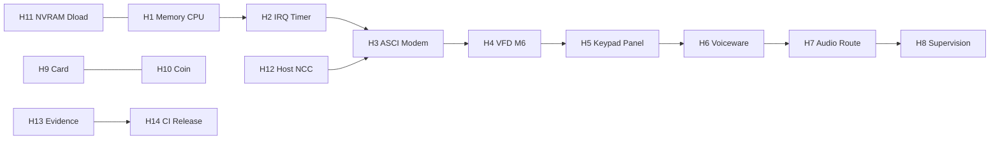

# Hardware implementation roadmap

**Purpose:** Order work so each step **builds**, produces **tests/traces**, and advances the **gap register** without claiming fake milestones.

## Principles

1. **Boot path first:** Until **M6** is reproducible (first honest `0x60` / VFD data evidence), many downstream “complete” claims remain **partial** or **complete_unverified**.  
2. **No fictional I/O:** Unknown behavior stays in compatibility-validation with explicit evidence requirements.  
3. **Traces as contracts:** Every device promotion to **complete_verified** for firmware-driven behavior needs a **named trace line** or **milestone** in `boot-trace.jsonl` / device JSONL, not only unit tests.  
4. **CI split:** Class A (fixtures, no MAME) vs Class C (real `coinline-mame`) per `docs/TESTING.md` / `TESTING.md`.

## Phases (mapped to H-tranches)

| Phase | Goal | Exit criteria |
| ----- | ---- | ------------- |
| **H0** | Baseline, gap register, reproducible build | This audit committed; `build-mame-coinline.ps1` green on dev machine; `ctest` label smoke |
| **H1** | Z180 + memory correctness | MMU/ROM/RAM assertions match `boot-milestone-status.json` style evidence; stack persists |
| **H2** | Interrupts + timers | interrupt-trace shows coherent path toward firmware-enabling IRQs (no fake storms) |
| **H3** | ASCI + modem + bridge | `asci-trace` + UART transcript for controlled scenario; DCD/CTS tied to model |
| **H4** | VFD | **M6** in boot trace + screenshot of firmware-driven display update |
| **H5** | Keypad + hookswitch + mach PIO | Regression tests green; mach_pio traces stable across firmware revs |
| **H6–H8** | Voiceware + audio route + supervision | WAV + audio JSONL + supervision JSONL in same run folder |
| **H9–H11** | Payment + NVRAM + download | No unsafe flash write in default harness |
| **H12** | Host + NCC path | Transcript with live or stubbed Host per `host-integration-plan.md` |
| **H13** | Scenarios + evidence bundles | `validate-boot-milestones.ps1` without smoke-only where claiming M10 |
| **H14** | CI + release | Skip rules documented; `hardware-final-status.md` updated per release |

## Current critical path (2026-05-04)

From `docs/status/remaining-work-estimate.md` and `boot-milestone-status.json`:

1. **P0 — M6:** Investigate **ASCI/modem readiness**, **EI/timer IRQ** path, and **host/install** gating; correlate `asci-trace.jsonl` with `millennium_modem` and board status.  
2. **P1 — M7–M10:** Longer `run-screenshot-capture.ps1` (e.g. 180 s), `validate-boot-milestones.ps1` (strict).  
3. **P2 — Audio Class C:** Enable harness tests currently **skip 77** where audio proof is required.

## Dependencies

## Not in this roadmap

- MIT CoinLine Host code (license isolation).  
- Claiming **M10** without validator + traces.  
- Replacing hardware with scenario-level fake state.
